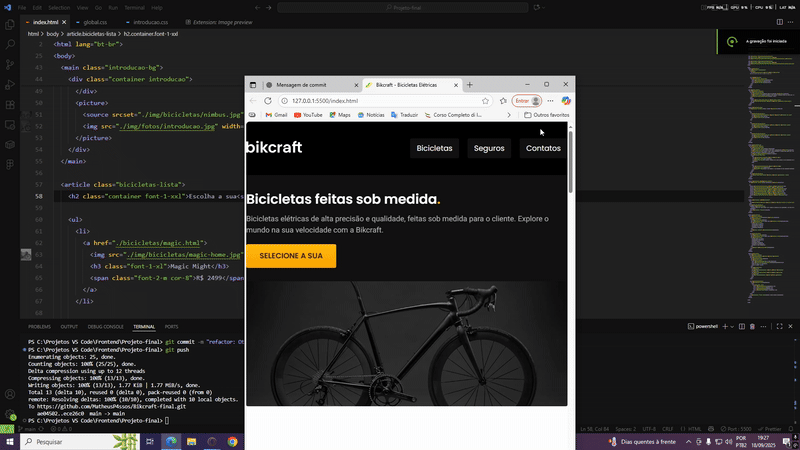
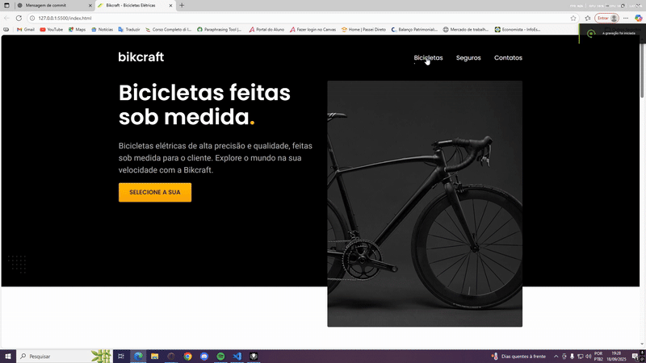
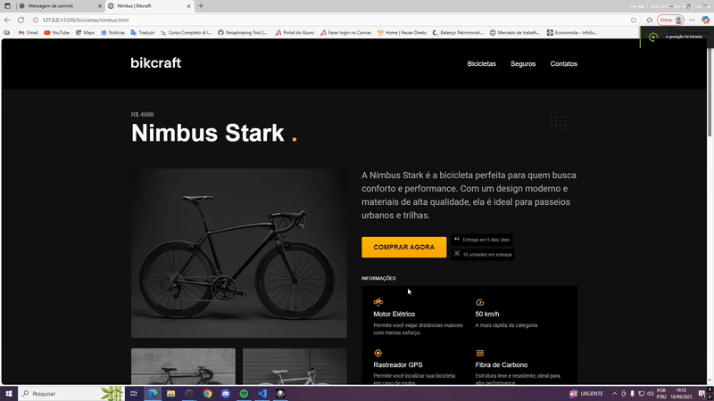

# Projeto Bikcraft

Projeto final do curso de **HTML & CSS básico** da Origamid, ministrado por **André Rafael**.  
O objetivo é criar um site para venda de bicicletas, aplicando boas práticas de HTML e CSS.

---

## 🧰 Tecnologias usadas

- HTML5
- CSS3 (Flexbox, Grid, responsividade)
- Boas práticas de estruturação semântica, acessibilidade mínima e design responsivo

---

## 📂 Estrutura do Projeto

```text
Bikcraft-final/
├── css/
│   ├── style.css
│   └── formulario.css
├── img/
│   └── (imagens de bicicletas, decorações, ícones, etc.)
├── orcamento/
│   └── (assets específicos para a página de orçamento)
├── bicicletas.html
├── contato.html
├── index.html
├── orcamento.html
├── seguros.html
└── termos.html
```

## 🎯 Funcionalidades Principais

Layout responsivo para diferentes larguras de tela (desktop, tablet, mobile)

Seletor de tipo de orçamento (Bikcraft ou Seguro) com exibição condicional dos produtos / planos

Estilização customizada para formulários, cards de produto, detalhes visuais com hover/focus

Seções informativas e de contato

Uso de variáveis CSS (--cor-\*) para facilitar manutenção de cores

## 🖥️ Demonstração

### 🏠 Página Home



### geral



### 💰 Orçamento



```
## 📐 Como usar / rodar localmente

1 - Clone este repositório:
git clone https://github.com/MatheusP4ssos/Bikcraft-final.git
2 - Abra o diretório do projeto no seu editor de código preferido.
3 - Abra o arquivo index.html no navegador.
4 - Para ver o funcionamento do orçamento com o input radio, teste clicando em “Bikcraft” ou “Seguro” para verificar as opções correspondentes.
```

## 🔍 Próximas melhorias

- Otimizar mais o projeto e substituir algumas funções utilizando JS

## 📄 Licença

Projeto desenvolvido para fins educacionais durante o curso da Origamid.
Uso pessoal ou de estudo é permitido.

## ✉️ Contato

Autor: Matheus Passos

GitHub: MatheusP4ssos

```

```
